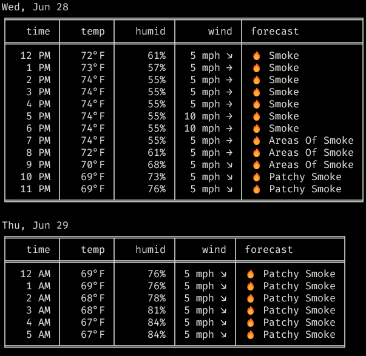

# lightningbug

## Requirements

- [jq](https://jqlang.github.io/jq/)
- [python](https://www.python.org/)
- [poetry](https://python-poetry.org/)

## Quickstart

1. Clone this repo.
2. At root of the repo, `pip install .`.
3. Type `weather` to get the forecast.
